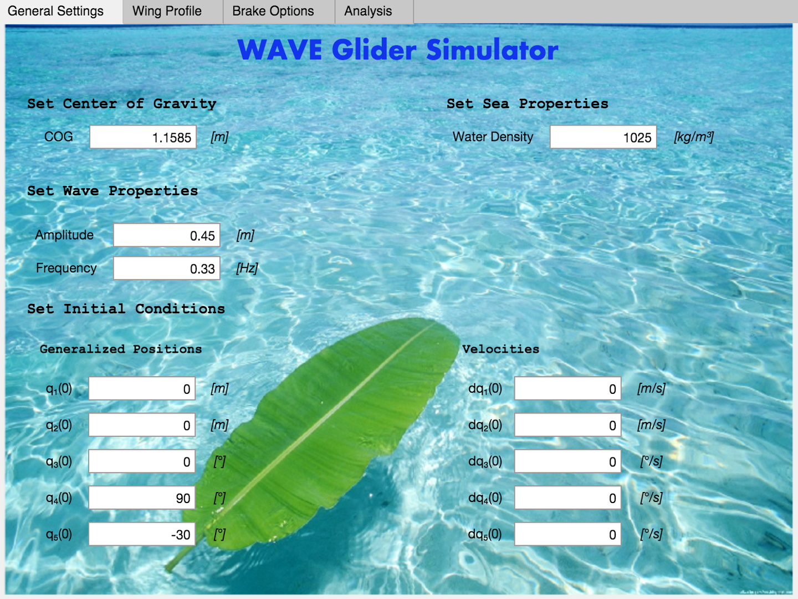
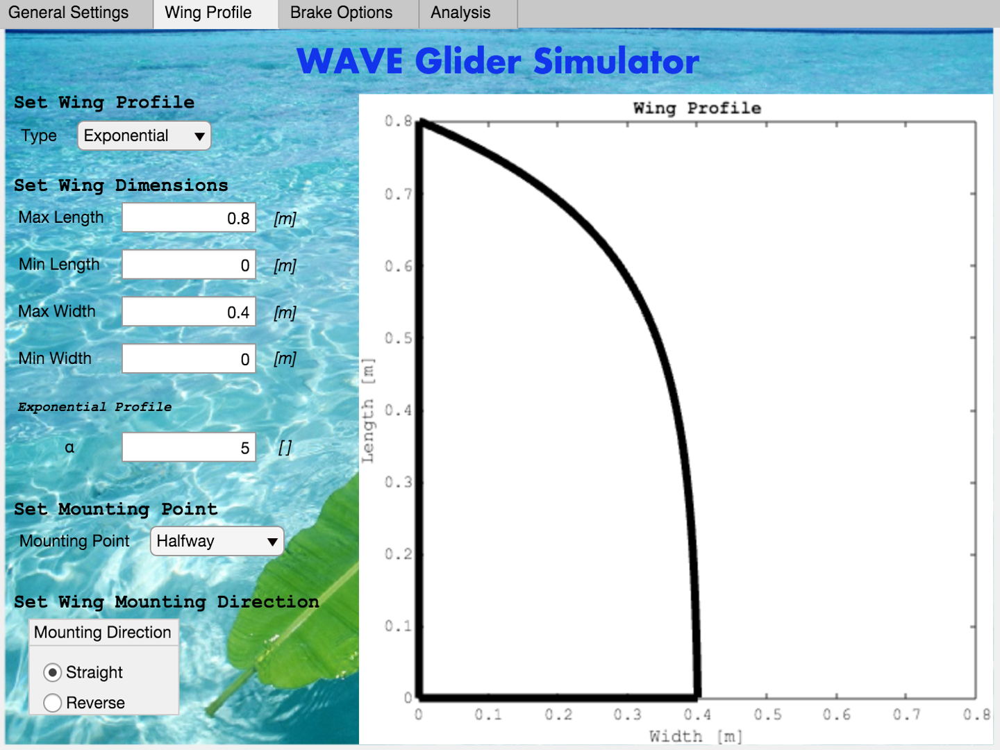
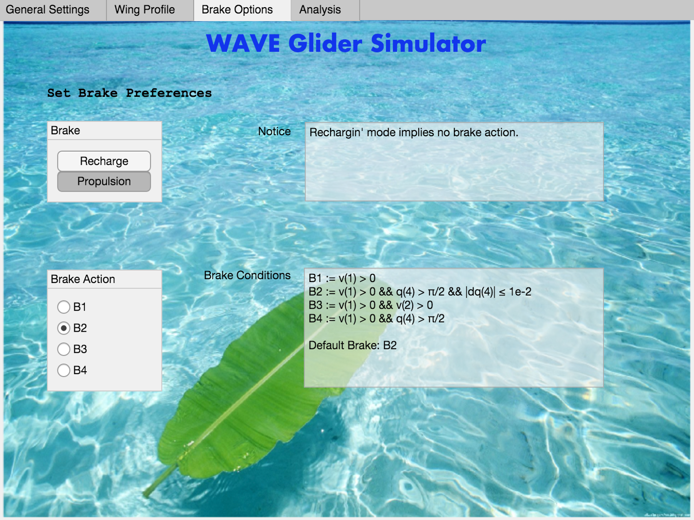
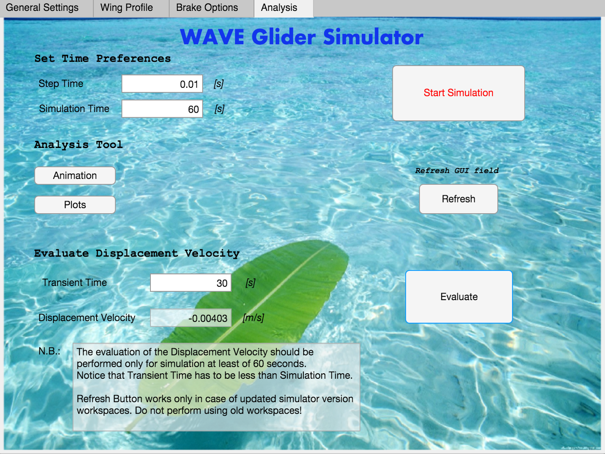

# WAVE: Simulation of Variable Blade Geometries and Braking Strategies for the Advancement of an AUV

This repository contains the code and materials developed by our team for the simulation of the performance of the eFolaga Plus, an Autonomous Underwater Vehicle (AUV) equipped with the WAVE module. Our project aimed to evaluate and improve the AUV's advancement by exploring the effects of varying the blade geometry and braking strategy of its arms.

## Objectives
The aim of the project is to evaluate and improve the performance of an AUV's advancement by varying the blade geometry and braking strategies of the arms in simulation. Through the development and design of a new wing profile and two new braking strategies, the project seeks to enhance the AUV performance. Additionally, a user interface (GUI) was created to facilitate easy interaction with the simulator and an existing simulator was integrated into the project.

## Contents
* The WAVE simulator - a tool used to simulate the performance of the AUV under different conditions
* A GUI - a graphical user interface to interact with the simulator, test wing profiles, and braking actions for the AUV.
* The simulation results - data generated from the simulator that shows how the AUV performed under various scenarios
* A report - a document detailing the project's progress and findings
* A presentation - a summary of the project

## References
1. A. Caiti, V. Calabrò, S. Grammatico, A. Munafò and M. Stifani, "Lagrangian modeling of the Underwater Wave Glider," OCEANS 2011 IEEE - Spain, Santander, Spain, 2011, pp. 1-6, doi: 10.1109/Oceans-Spain.2011.6003429.
2. R. Salmon "Introduction to Ocean Waves", Scripps Institution of Oceanography, University of California, San Diego.

## GUI

The GUI provides a graphical user interface for interacting with the simulator and testing different wing profiles and braking actions for the AUV. The screenshots below show different views of the GUI:

* General settings

* Wing profile

* Braking options

* Analysis
